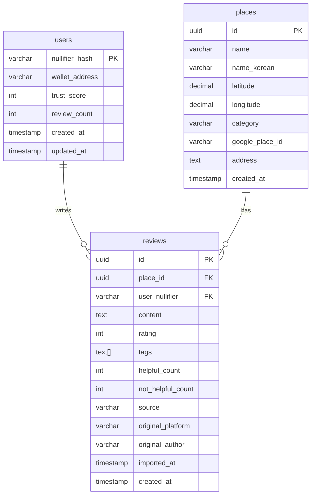

# feat: Seed Data + Map View

## Overview

Add 15-20 resident-essential places in Jongno-gu with real foreigner reviews scraped from Google Maps, displayed on a Mapbox map with emoji pins. This transforms the "Map Coming Soon" placeholder into a functional, demo-ready map view.

**Key differentiator**: Masil targets foreigners who **live** in Korea, not tourists. Focus on ATMs, hospitals, pharmacies, and everyday restaurants.

## Problem Statement / Motivation

Currently, the authenticated /home page shows "Map Coming Soon". For the hackathon demo (Feb 7, 2026 13:00 KST), we need:
- Visual proof the app works (map with pins)
- Real content (actual foreigner reviews from Google Maps)
- Resident-focused positioning (not tourist attractions)

## Proposed Solution

### Data Pipeline
1. User curates 15-20 Google Maps place URLs (resident essentials)
2. Outscraper scrapes reviews from those URLs
3. Filter script keeps only: non-Korean author names + English text
4. Import script populates Supabase `places` and `reviews` tables

### Map Component
1. Mapbox GL JS map centered on Insadong, Jongno-gu
2. Emoji pins by category (🏧 ATM, 🏥 hospital, 💊 pharmacy, 🍽️ restaurant)
3. Click pin → Mapbox popup shows place name

## Technical Considerations

### Database Schema

**Category mapping** (updated from PRD to match resident focus):
```typescript
const CATEGORIES = {
  atm: { emoji: "🏧", label: "ATM" },
  hospital: { emoji: "🏥", label: "Hospital/Clinic" },
  pharmacy: { emoji: "💊", label: "Pharmacy" },
  restaurant: { emoji: "🍽️", label: "Restaurant" },
  cafe: { emoji: "☕", label: "Cafe" },
  service: { emoji: "🔧", label: "Service" },
  other: { emoji: "📍", label: "Other" },
} as const;
```

**Places table** (`app/supabase/migrations/002_create_places.sql`):
```sql
CREATE TABLE places (
  id UUID PRIMARY KEY DEFAULT gen_random_uuid(),
  name VARCHAR(255) NOT NULL,
  name_korean VARCHAR(255),
  latitude DECIMAL(10, 8) NOT NULL,
  longitude DECIMAL(11, 8) NOT NULL,
  category VARCHAR(50) NOT NULL,
  google_place_id VARCHAR(255),
  address TEXT,
  created_at TIMESTAMP WITH TIME ZONE DEFAULT NOW()
);

CREATE INDEX idx_places_category ON places(category);
CREATE INDEX idx_places_location ON places(latitude, longitude);
```

**Reviews table** (`app/supabase/migrations/003_create_reviews.sql`):
```sql
CREATE TABLE reviews (
  id UUID PRIMARY KEY DEFAULT gen_random_uuid(),
  place_id UUID NOT NULL REFERENCES places(id) ON DELETE CASCADE,
  user_nullifier VARCHAR(66) REFERENCES users(nullifier_hash),
  content TEXT NOT NULL,
  rating INTEGER CHECK (rating >= 1 AND rating <= 5),
  tags TEXT[] DEFAULT '{}',
  helpful_count INTEGER DEFAULT 0,
  not_helpful_count INTEGER DEFAULT 0,
  source VARCHAR(20) DEFAULT 'user',
  original_platform VARCHAR(50),
  original_author VARCHAR(100),
  imported_at TIMESTAMP WITH TIME ZONE,
  created_at TIMESTAMP WITH TIME ZONE DEFAULT NOW()
);

CREATE INDEX idx_reviews_place_id ON reviews(place_id);
CREATE INDEX idx_reviews_source ON reviews(source);
```

### Foreigner Review Detection

**Korean name filter** - exclude names containing ANY Hangul characters:
```typescript
const containsKorean = (text: string): boolean => {
  // Hangul Unicode ranges: Syllables, Jamo, Compatibility Jamo
  return /[\uAC00-\uD7AF\u1100-\u11FF\u3130-\u318F]/.test(text);
};

// Filter: keep if author name has NO Korean AND review is in English
const isForeignerReview = (review: OutscraperReview): boolean => {
  return !containsKorean(review.author_title) &&
         isEnglish(review.review_text) &&
         review.review_text.length >= 20;
};
```

**English detection** - simple heuristic (good enough for hackathon):
```typescript
const isEnglish = (text: string): boolean => {
  if (!text) return false;
  // Check if mostly ASCII letters (allows some non-ASCII punctuation)
  const asciiLetters = text.match(/[a-zA-Z]/g)?.length || 0;
  return asciiLetters / text.length > 0.5;
};
```

### Map Configuration

- **Center**: Insadong (37.5742, 126.9857)
- **Zoom**: 14 (neighborhood level)
- **Bounds**: None for MVP (user can pan freely)
- **Clustering**: None for MVP (15-20 pins won't overlap badly)

### Outscraper Data Format

Outscraper returns JSON with structure:
```typescript
interface OutscraperPlace {
  name: string;
  full_address: string;
  latitude: number;
  longitude: number;
  place_id: string;
  reviews_data: OutscraperReview[];
}

interface OutscraperReview {
  author_title: string;  // Reviewer name
  review_text: string;
  review_rating: number; // 1-5
  review_datetime_utc: string;
}
```

## Acceptance Criteria

### Database
- [ ] Migration `002_create_places.sql` creates places table with all columns
- [ ] Migration `003_create_reviews.sql` creates reviews table with import columns
- [ ] Both migrations run successfully on Supabase

### Seed Data
- [ ] Filter script (`scripts/filter-reviews.ts`) filters Outscraper JSON
- [ ] Import script (`scripts/import-seed-data.ts`) populates both tables
- [ ] 15-20 places imported with coordinates
- [ ] Each place has 1-10 foreigner reviews (or shows "No reviews yet")
- [ ] Imported reviews have `source: 'imported'`, `original_platform: 'google_maps'`

### API
- [ ] `GET /api/places` returns all places with id, name, lat, lng, category
- [ ] Response is JSON array, no pagination needed for 15-20 items
- [ ] Endpoint requires authentication (redirect if no auth cookie)

### Map View
- [ ] Mapbox GL JS renders on /home page
- [ ] Map centered on Insadong at zoom 14
- [ ] Each place shows as emoji pin based on category
- [ ] Click pin → Mapbox popup shows place name
- [ ] Loading spinner while fetching places
- [ ] Error state if API fails

### Testing
- [ ] Map loads in World App webview
- [ ] Pins are tappable on mobile
- [ ] Works after fresh auth flow

## Success Metrics

- Map displays with all seeded places visible
- Demo judges can tap pins and see place names
- Visual proof of "resident-focused" positioning (ATMs, hospitals visible)

## Dependencies & Risks

| Dependency | Status | Risk |
|------------|--------|------|
| Outscraper account | User will set up | Low - straightforward signup |
| Mapbox API key | User has key | None |
| Place URL list | User will curate | Medium - time-consuming manual work |
| Supabase migrations | Ready to implement | Low |

**Risks:**
- **Outscraper might not return coordinates**: Mitigation - verify with test scrape first
- **Too few foreigner reviews after filter**: Mitigation - lower minimum length to 10 chars if needed
- **Mapbox doesn't work in World App webview**: Mitigation - test early, fallback to static map image

## Implementation Tasks

### Phase 1: Database Setup
- [x] Create `app/supabase/migrations/002_create_places.sql`
- [x] Create `app/supabase/migrations/003_create_reviews.sql`
- [ ] Run migrations on Supabase
- [x] Add Place and Review interfaces to `app/lib/db.ts`
- [x] Add `getPlaces()` function to `app/lib/db.ts`

### Phase 2: Seed Data Scripts
- [x] Create `app/scripts/filter-reviews.ts` (filter Outscraper JSON)
- [x] Create `app/scripts/import-seed-data.ts` (import to Supabase)
- [x] Add npm scripts to package.json
- [ ] Document Outscraper scraping instructions in README or separate doc

### Phase 3: API Endpoint
- [x] Create `app/app/api/places/route.ts` (GET all places)
- [x] Add auth check (redirect if no cookie)
- [x] Return places with coordinates and category

### Phase 4: Map Component
- [x] Install `mapbox-gl` and `@types/mapbox-gl`
- [ ] Add `NEXT_PUBLIC_MAPBOX_TOKEN` to `.env.local`
- [x] Create `app/app/components/Map.tsx` (Mapbox with pins)
- [x] Update `app/app/home/page.tsx` to use Map component
- [x] Implement emoji pin markers by category
- [x] Implement click → popup with place name

### Phase 5: Polish & Test
- [x] Add loading state to map
- [x] Add error state if API fails
- [ ] Test in World App on mobile
- [ ] Verify pins are tappable

## Files to Create/Modify

| File | Action | Purpose |
|------|--------|---------|
| `app/supabase/migrations/002_create_places.sql` | Create | Places table |
| `app/supabase/migrations/003_create_reviews.sql` | Create | Reviews table |
| `app/lib/db.ts` | Modify | Add Place, Review interfaces + getPlaces() |
| `app/scripts/filter-reviews.ts` | Create | Filter Outscraper JSON |
| `app/scripts/import-seed-data.ts` | Create | Import data to Supabase |
| `app/app/api/places/route.ts` | Create | GET /api/places endpoint |
| `app/app/components/Map.tsx` | Create | Mapbox map component |
| `app/app/home/page.tsx` | Modify | Replace placeholder with Map |
| `package.json` | Modify | Add mapbox-gl, seed scripts |
| `.env.local` | Modify | Add NEXT_PUBLIC_MAPBOX_TOKEN |

## ERD



## References

### Internal
- Brainstorm: `docs/brainstorms/2026-02-06-seed-data-map-view-brainstorm.md`
- Technical PRD: `docs/Technical PRD.md` (lines 306-364 for schema, 478-625 for seed data)
- CLAUDE.md: Project conventions and tech stack
- Existing DB pattern: `app/lib/db.ts` (createServerClient, upsertUser)
- Existing API pattern: `app/app/api/auth/verify/route.ts`

### External
- Outscraper: https://outscraper.com (Google Maps scraping)
- Mapbox GL JS: https://docs.mapbox.com/mapbox-gl-js/
- World Mini App docs: https://docs.world.org/mini-apps/

### Learnings Applied
- MiniKit must have app_id: `docs/solutions/integration-issues/world-minikit-qr-code-not-working.md`
